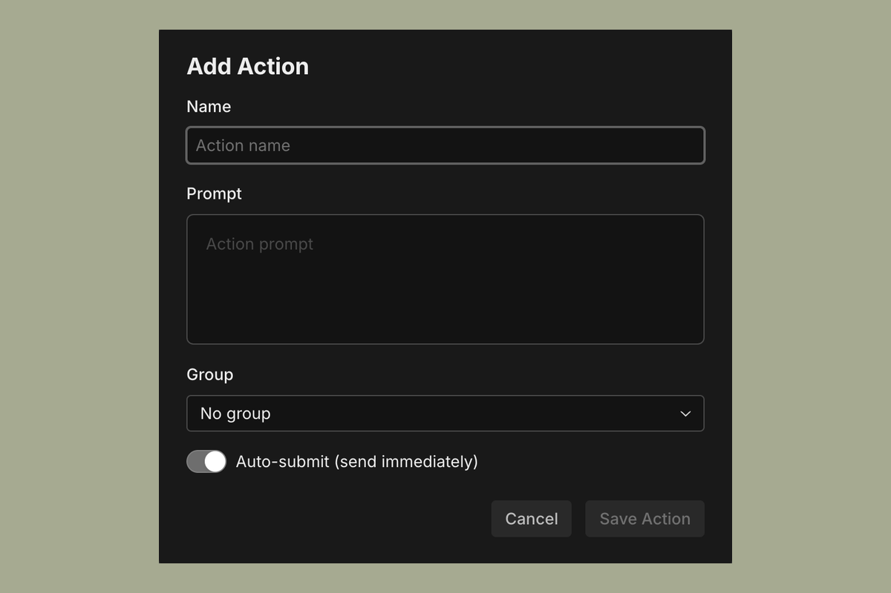

# Actions

Actions are saved prompts. If you have a task you run repeatedly, like a code review checklist, a deployment instruction, a standard refactor pattern, you can save it as an Action and trigger it in one click instead of retyping it.

---

## Creating an action

In the Actions panel on the right side of the Sculptor window, click the **+** button in the panel header. Give the action a name and write the prompt you want to save.

---

## Using an action

Click any action in the Actions panel to send it as a message to the current agent. The prompt populates in the chat and is sent immediately.

Actions are a good fit for things like:

- "Review the most recent changes for any security issues"
- "Write a changelog entry for the last commit"
- "Run the test suite and summarize any failures"

---

## Organizing actions

Right-click inside the Actions panel to add a new action or a group. Groups let you keep related actions together — for example, a "Review" group and a "Tests" group — and you can collapse a group's header to hide its actions.
