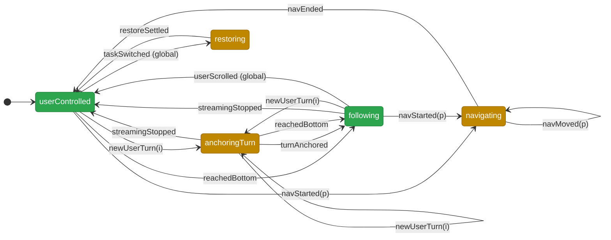
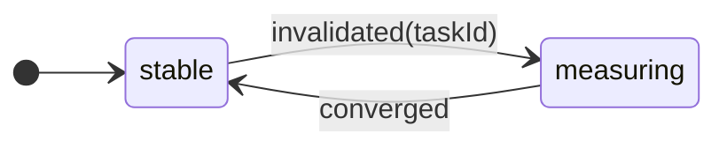
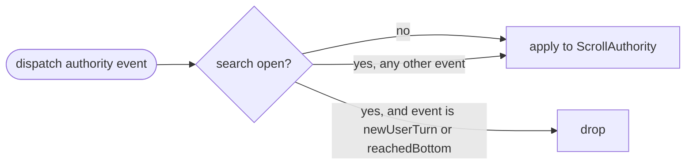

# Unifying alpha-chat scroll behavior into an explicit state machine

Status: **reference** — the migration described here has landed. Audience:
Sculptor frontend maintainers.

This document explains *why* the alpha chat's scroll behavior is being reworked
into a single explicit state machine, *what* that machine is, and *how* the
migration is staged. If you are touching anything under
`sculptor/frontend/src/pages/workspace/components/chat-alpha/hooks/`, read this
first.

---

## The state machine at a glance

Scroll behavior is three concerns. **`ScrollAuthority`** (who is moving
`scrollTop`, and why) is the primary machine. **`LayoutPhase`** (the
virtualizer's measurement settle) is an orthogonal machine. Search
**suppression** is a top-level guard, not a phase.

### `ScrollAuthority` — who owns `scrollTop`

Green phases are *settled* (quiescent); amber phases are *transient/busy*.
`userScrolled` and `taskSwitched` are **global** — valid from every phase — and
are drawn once below to keep the graph readable.



> The two **global** transitions apply from *every* phase, not just the one
> they're drawn from: `userScrolled → userControlled` (the user always wins) and
> `taskSwitched → restoring` (a switch always restarts a restore). The reducer
> handles both before the per-phase `switch`, so they need exactly one line each.

### `LayoutPhase` — virtualizer measurement settle (orthogonal)



### Suppression — a top-level dispatch guard (orthogonal)



### The signal tests await

```
data-scroll-phase   = ScrollAuthority.kind
data-scroll-settled = (authority is userControlled OR following) AND layout is stable
```

### Edge cases & non-obvious transitions

- **`userScrolled` is global and always wins.** From any phase it returns to
  `userControlled`. This single rule stops a late restore/settle frame from
  clobbering a scroll the user just made — the original flake. The deferred
  restore re-assert re-checks that the phase is still `restoring` before
  re-applying, so a mid-restore user scroll cancels it.
- **`taskSwitched` is global.** A switch from any phase — even mid-`restoring` —
  restarts `restoring`, so rapid tab switches can't strand the machine.
- **`anchoringTurn → userControlled` on `streamingStopped`.** A short response
  that finishes before it ever overflows the viewport ends the turn *without*
  entering `following` — there is nothing to follow.
- **`anchoringTurn → following` on `reachedBottom`.** Jumping to the bottom while
  a new turn is anchored hands off to pin-to-bottom.
- **`following` counts as settled.** It is a stable steady mode, not a transient
  one-shot scroll, so `data-scroll-settled` is true in it (given `layout ==
  stable`). `restoring` / `anchoringTurn` / `navigating` are busy.
- **`isEngaged` is derived, never stored.** It is `following ∨ anchoringTurn` —
  there is no independent "engaged" boolean that could disagree with the phase.
- **Leaving `anchoringTurn` fires side effects.** However the machine leaves the
  anchoring phase (user scroll, overflow into `following`, `streamingStopped`, or
  `taskSwitched`), one re-entrancy-safe store subscription tears down the
  scroll-to-top CSS animation and clears jump-suppression. That same
  subscription re-engages `following` when a restore settles to `userControlled`
  on a still-streaming task whose restored view sits at the bottom (the
  streaming-start engage check is a no-op while `restoring`).
- **Suppression is an orthogonal guard.** While in-chat search is open the store
  drops only the two *initiation* events (`newUserTurn`, `reachedBottom`);
  completion and global events still apply, so the machine can always reach a
  settled state even if search opens mid-turn.
- **`LayoutPhase` is orthogonal.** `data-scroll-settled` also requires
  `layout === stable`, so geometry (scrollHeight, message offsets) has stopped
  moving before a test reads it.

---

## Motivating prompt

The maintainer who initiated this work framed the problem as follows:

> Please look at the underlying issue holistically. Look at it more than just the
> one case, but the entire cluster.
>
> Consider the software principle: Make incorrect states impossible to represent.
>
> Consider also the software principle: use the type system to express
> sequences/state machines.
>
> Given both these requirements, while still respecting the major architectural
> constraints of sculptor, is there a broader fix that we can make that will
> solve this problem more holistically, and make representation of scroll
> behavior a simple, deterministic and clean abstraction? I am asking for an
> explicit, in-the-code, not a comment but actual semantic spelling out of the
> states and transitions of the system in question.
>
> If there are only a few features or current requirements that stand in the way
> of this implementation, please flag those requirements to me.
>
> Additional context to keep in the background: agents often invent/complicate
> systems by writing extremely defensive code at a local level, without
> realizing that at a macro level the underlying problem has a much simpler,
> elegant solution. I am asking you to take a step back on this class of flakes
> and find that elegant solution.

---

## The problem: an implicit state machine smeared across five files

A whole cluster of CI flakes (tracked under SCU-1566) shares one signature —
`Page.wait_for_function: Timeout 30000ms` — across the alpha-chat scroll tests
(`test_alpha_scroll_task_switch`, `test_alpha_scroll_behaviors`,
`test_alpha_scroll_padding_agent_switch`, `test_alpha_scroll_auto_scroll`,
`test_alpha_scroll_prompt_nav`, …).

They are not separate bugs. The alpha chat already *has* a scroll state machine;
it is simply implicit, distributed across ~11 boolean refs in five files, and
mutated from event handlers, `requestAnimationFrame` callbacks, `ResizeObserver`
callbacks, and layout effects — sequenced only by prose comments such as "this
hook's layout effect runs before that one's by call order."

| Flag | Owner | Form |
| --- | --- | --- |
| `isRestoringRef` | `useAlphaScrollPersistence` | ref |
| `isSettlingRef` + `settleGeneration` | `useAlphaVirtualizer` | ref + state |
| `isEngagedRef` / `isEngaged` | `useAlphaAutoScroll` | ref **and** state |
| `isAtBottomRef` / `isAtBottom` | `useAlphaAutoScroll` | ref **and** state |
| `isFillingRef` + `fillingAnchorIndexRef` | `useAlphaAutoScroll` | ref |
| `isSuppressedRef` / `isSuppressed` | `useAlphaAutoScroll` | ref + state |
| `isUserScrollingRef` | `useAlphaAutoScroll` | ref |
| `isProgrammaticScrollRef` | `AlphaChatInterface` (shared) | ref |
| `isNavigatingRef` | `AlphaChatInterface` (shared) | ref |

That is on the order of 2¹¹ representable combinations, of which only a handful
are legal. Every flake in the cluster has the same shape: **two of these flags
disagree about who owns `scrollTop`, across an animation-frame boundary** — and
because no single value names the combined state, a test cannot *await* the
system being ready. It can only poll geometry (`scrollTop` stability, exact
`scrollHeight` equality, message offsets) and hope the dust has settled, which
under CI load it sometimes never does within the budget.

Symptom-by-symptom, the same root cause:

| Flaky test | Surface symptom | Underlying illegal/unobservable state |
| --- | --- | --- |
| `test_scroll_position_restored_on_task_switch` | `scrollTop < 10` never holds | the deferred restore re-assert fires *after* the user/test already scrolled — "restoring" and "user is in control" are both true |
| `test_scroll_height_settles_after_agent_switch` | `scrollHeight === before` never holds | virtualizer measurement settle has **no observable "done"** |
| `test_first_message_visible_after_agent_switch`, `test_dynamic_padding_survives_agent_switch` | message offset never lands | same settle, different assertion |
| `test_arrow_up_*` (prompt nav) | highlight/scroll never lands | `isNavigating` + the 500 ms scroll-spy freeze racing an async `scrollToIndex` and user input |
| `test_auto_scroll_and_jump_to_bottom` | jump-to-bottom attribute wrong | `isEngaged` × `isAtBottom` × `isFilling` combination is internally inconsistent for a frame |

A local fix for any one of these (e.g. adding *another* flag/attribute, or a
test-side "wait until scrollTop is stable for N frames" helper) is exactly the
defensive-local-patch trap: it treats a symptom and leaves the 2¹¹-state space
intact for the next collision to find.

## The principle: make illegal states unrepresentable; use types for the sequence

Collapse the boolean soup into **one explicit, typed state value** with a single
writer, and model scroll as a finite state machine whose transitions are total
functions. Then:

- Illegal combinations (`restoring` *and* `following`, `filling` *and*
  `at bottom`) cannot be constructed — they are not in the type.
- "A real user input always wins" is expressed **once**, not re-derived in four
  hooks.
- "Settled" stops being a geometry heuristic and becomes a value the DOM
  advertises, so tests `await` a state instead of polling pixels.

## The design

Scroll behavior decomposes into three concerns. Two are small finite state
machines; one is a derived observation. Keeping them separate (rather than one
giant union) is deliberate — they are genuinely orthogonal, and conflating them
is what produced the soup.

### 1. `ScrollAuthority` — who is moving `scrollTop`, and why

Exactly one actor owns `scrollTop` at any instant. Programmatic phases are
transient and always resolve back to `userControlled`. A genuine user input
preempts any of them.

```ts
// scrollAuthority.ts
export type ScrollAuthority =
  | { kind: "userControlled" }                          // settled; the user owns scrollTop
  | { kind: "restoring"; taskId: string }               // applying saved position after a switch
  | { kind: "anchoringTurn"; anchorIndex: number }      // new user message animating/placing at top
  | { kind: "following" }                               // pinned to bottom, following the stream
  | { kind: "navigating"; promptIndex: number };        // keyboard prompt navigation

// Events are named by *cause*, never by effect — the reducer is the single place
// that decides the effect.
export type ScrollEvent =
  | { kind: "taskSwitched"; taskId: string }
  | { kind: "restoreSettled" }
  | { kind: "userScrolled" }                            // hardware wheel/touch/key — always wins
  | { kind: "newUserTurn"; index: number }
  | { kind: "turnAnchored" }
  | { kind: "reachedBottom" }                           // user scrolled to the very bottom mid-stream
  | { kind: "streamingStopped" }
  | { kind: "navStarted"; promptIndex: number }
  | { kind: "navMoved"; promptIndex: number }
  | { kind: "navEnded" };

export const nextAuthority = (s: ScrollAuthority, e: ScrollEvent): ScrollAuthority => {
  if (e.kind === "userScrolled") return { kind: "userControlled" };   // the one global invariant
  if (e.kind === "taskSwitched") return { kind: "restoring", taskId: e.taskId };

  switch (s.kind) {
    case "userControlled":
      if (e.kind === "newUserTurn")   return { kind: "anchoringTurn", anchorIndex: e.index };
      if (e.kind === "reachedBottom") return { kind: "following" };
      if (e.kind === "navStarted")    return { kind: "navigating", promptIndex: e.promptIndex };
      return s;
    case "restoring":
      if (e.kind === "restoreSettled") return { kind: "userControlled" };
      return s;
    case "anchoringTurn":
      if (e.kind === "turnAnchored")  return { kind: "following" };
      return s;
    case "following":
      if (e.kind === "streamingStopped") return { kind: "userControlled" };
      if (e.kind === "newUserTurn")      return { kind: "anchoringTurn", anchorIndex: e.index };
      return s;
    case "navigating":
      if (e.kind === "navMoved") return { kind: "navigating", promptIndex: e.promptIndex };
      if (e.kind === "navEnded") return { kind: "userControlled" };
      return s;
  }
};
```

The reducer is **pure, total, and exhaustively typed** (the `switch` is
checked for exhaustiveness by the compiler). It is the entire spec of the
sequence, in one place, testable without a DOM.

### 2. `LayoutPhase` — the virtualizer's measurement lifecycle

Independent of who owns the scroll: after a task switch the virtualizer
invalidates measurements and the dynamic `paddingEnd` reconverges over a couple
of frames. That convergence is what `test_scroll_height_settles` was trying to
observe.

```ts
// layoutSettle.ts
export type LayoutPhase =
  | { kind: "stable" }
  | { kind: "measuring"; sinceTaskId: string };   // remeasuring; paddingEnd not yet converged

export const nextLayout = (
  s: LayoutPhase,
  e: { kind: "invalidated"; taskId: string } | { kind: "converged" },
): LayoutPhase => (e.kind === "invalidated" ? { kind: "measuring", sinceTaskId: e.taskId } : { kind: "stable" });
```

### 3. At-bottom-ness is a derived projection over the phase

Whether the viewport is at the bottom drives the jump-to-bottom button (and the
active-dot stick-to-bottom). It is **derived, never an independent mode** — a pure
projection of the authority phase over one sampled geometry bit
(`projectAtBottom`):

- `following` ⇒ at the bottom (we are pinning there by definition);
- `anchoringTurn` ⇒ not at the bottom (a new turn sits at the top while its
  response fills in below);
- every other phase ⇒ the last sampled geometry.

The phase override is the whole point: the button can no longer disagree with the
scroll mode (an independent stored at-bottom flag was the source of "the button
says one thing while the scroll says another"). The only thing stored is the raw
geometry *sample* — `geometryAtBottom`, written by the scroll/resize observers —
an observation of external reality like `scrollTop` itself, not a mode.

The sample measures distance to the *content* bottom, not `scrollHeight`:

```ts
distanceFromContentBottom = scrollHeight - paddingEnd - scrollTop - clientHeight
```

The virtualizer inflates the container with a dynamic `paddingEnd` so a freshly
anchored user message can reach the top of the viewport; that padding is empty
space below the last message. Measuring against `scrollHeight` (which includes the
padding) made the viewport read as "not at the bottom" while visibly at the bottom
— most visibly, the jump-to-bottom button staying lit after a non-streaming jump.
Subtracting `paddingEnd` is the single correction, shared by every at-bottom check
as the one `distanceFromContentBottom` primitive.

The same correction governs *pinning* to the bottom, not just *measuring* it. Every
"scroll to the bottom" site (the `following` pin, the anchoring→following handoff,
the jump-to-bottom button, the restore-to-bottom) sets `scrollTop` to the inverse of
that primitive — `contentBottomOffset = scrollHeight − paddingEnd − clientHeight` —
so the last message's content bottom sits flush with the viewport bottom
(`distanceFromContentBottom == 0`), leaving `paddingEnd` as empty slack *below*
`scrollTop`. It deliberately does **not** pin with `virtualizer.scrollToIndex(last,
{ align: "end" })`: for the final item TanStack resolves that to
`getMaxScrollOffset()` — the very bottom of the *padded* scroll range — which parks
`scrollTop` inside the `paddingEnd` gap with **zero** slack. Two failures followed:
the last line floated a `paddingEnd`-tall gap above the viewport bottom
while following, and — the turn-end jump — when a turn ended and its streaming cursor
was removed, the last message shrank with no slack to absorb it, so the browser
clamped `scrollTop` down by the shrink and the whole conversation jumped up. Pinning
to the content bottom leaves the `paddingEnd` slack the shrink is absorbed into. The
pin is also **down-only**: it follows the live tail's growth toward the bottom but
never scrolls *up*, so a turn-end shrink is left where it is rather than chased
(authority has already handed back to `userControlled` by then anyway).

### 4. Search suppression is a top-level guard

When in-chat search is open, auto-scroll behaviors are suspended. Rather than add
a `searching` member to the authority union (which would multiply every phase by
"is search open"), suppression is a **single top-level boolean on the store that
gates dispatch**: while suppressed, only the auto-scroll *initiation* events
(`newUserTurn`, `reachedBottom`) are dropped, so a search session never starts
pinning or anchoring. Completion events (`turnAnchored`, `streamingStopped`,
`restoreSettled`, `navEnded`) and the globals (`userScrolled`, `taskSwitched`)
still apply, so the machine can always reach a settled state. This keeps the
union strictly about *authority*.

### 5. Reflow restoration is a derived projection over the phase

A content reflow — a viewport **width** change that re-wraps the paragraph text, an
above-fold item growing, a streamed token — changes geometry under whatever the
authority phase is. What scrollTop should do in response is **not** a new mode; it
is a pure projection over the phase, exactly like `projectAtBottom`. Collapsing it
into one typed policy is what replaced two phase-specific `ResizeObserver`s (a
streaming "pin/anchor" observer and an idle "stay-glued" observer) whose scattered
`isEngaged` / `projectAtBottom` / `authority === userControlled` conditionals were
the same illegal-state soup the rest of this migration removed.

```ts
export type ReflowAction =
  | { kind: "pinBottom" }                          // keep the last message's end in view
  | { kind: "holdAnchor"; anchor: ReadingAnchor }  // keep the reading anchor at its offset
  | { kind: "holdTurn"; anchorIndex: number }      // keep the anchored turn at the top
  | { kind: "ignore" };                            // a restore/nav owner drives scrollTop

export const projectReflow = (state: ScrollMachineState): ReflowAction => {
  switch (state.authority.kind) {
    case "following":              return { kind: "pinBottom" };
    case "anchoringTurn":          return { kind: "holdTurn", anchorIndex: state.authority.anchorIndex };
    case "restoring":
    case "navigating":             return { kind: "ignore" };
    case "userControlled":         // an idle user keeps their reading position — a resize never re-pins
      return state.readingAnchor === null ? { kind: "ignore" } : { kind: "holdAnchor", anchor: state.readingAnchor };
  }
};
```

A single content `ResizeObserver` (connected whenever search is not suppressing
auto-scroll) samples at-bottness, then performs the one action `projectReflow`
chose: `pinBottom` re-pins the last message (only while `following` the live tail);
`holdTurn` keeps the freshly-anchored user message at the top and hands off to
`following` once its response overflows; `holdAnchor` restores the reading anchor;
`ignore` leaves scrollTop to the restore/nav owner or the virtualizer's default.

**A resize never re-pins an idle view to the bottom.** Only `following` — the
explicit "watching the live tail" mode — pins, so whether a stream is running is
already carried by the phase, not a separate bit (an earlier `isStreaming` parameter
to `projectReflow` was removed along with the idle pin). An idle `userControlled`
user keeps their reading position across a reflow: the virtualizer grows the visible
port naturally (its default behavior) and the jump-to-bottom button surfaces if the
bottom drifts out of view. Re-pinning an *idle* view to the bottom on a resize was a
malformed requirement — see *Reflow re-pin: a requirement we deleted* below.

#### The reading anchor, and why `holdAnchor` is not just per-item compensation

`ReadingAnchor = { messageIndex, viewportOffset }` is a **sample**, written by the
scroll observer on genuine user scrolls only (a correction scroll during the reflow
must not overwrite the position we are preserving), stored on the machine beside
`geometryAtBottom` and read **only** by `projectReflow` — it never drives a render,
so it updates state in place without notifying subscribers.

TanStack Virtual already preserves scroll across item-size changes via
`shouldAdjustScrollPositionOnItemSizeChange`: when an item *entirely above* the fold
grows, it shifts scrollTop by the same delta. Two reasons that is not enough on its
own:

1. It had an off-by-`delta` bug. The predicate is handed the *cached* (pre-growth)
   measurement, so `item.start + item.size` is already the pre-growth end; the old
   code subtracted `delta` again, which drove the pre-growth end negative when an
   in-view item grew by more than its own height — wrongly classifying the reading
   anchor as "above the fold" and compensating it. On a narrowing reflow that is
   exactly the symptom: the top message re-wraps much taller and the view jumps down
   a full message height. Removing the stray `- delta` is the root-cause fix (SCU-1566).
2. The first message sits below a **non-virtualized intro** reserved by `paddingStart`.
   That intro re-wraps taller when narrowed too, and per-item compensation cannot see
   it (it is not a virtual item). `holdAnchor` restores scrollTop *absolutely* from
   the anchor message's fresh `start` minus its sampled `viewportOffset`, so it holds
   the reader steady across the intro and any above-fold items uniformly.

This also retired `useViewportStability` — a third, unwired implementation of the
same "preserve the reading position" idea (it compensated only strictly-above-fold
items and was never called in production).

### The store: one writer, ref-backed, selectively reactive

A `useReducer`/`useState` machine is **not** viable here: the `following` phase
re-pins every animation frame during streaming, and the existing code uses refs
precisely to avoid re-rendering the virtualized list (and tearing down the
`ResizeObserver`) on every such tick. So the machine lives in a **ref-backed
external store** that:

- holds `{ authority, layout, isSuppressed, geometryAtBottom, readingAnchor }` —
  the first three are modes; `geometryAtBottom` and `readingAnchor` are raw
  *samples* the observers write, read only through the projections
  (`projectAtBottom`, `projectReflow`) and never directly,
- exposes `dispatch(event)`, `getState()`, `setGeometryAtBottom(atBottom)`,
  `setReadingAnchor(anchor)`, and `subscribe(listener)`,
- mirrors the authority kind onto the scroll container as `data-scroll-phase`
  and a derived `data-scroll-settled` on every transition,
- is read by React components that genuinely must re-render (e.g. the
  jump-to-bottom button) via `useSyncExternalStore` with a selector, so
  high-frequency `following` ticks do not re-render anything that didn't select
  them.

```ts
// data-scroll-settled := authority is quiescent AND layout has converged.
const isSettled = (a: ScrollAuthority, l: LayoutPhase): boolean =>
  (a.kind === "userControlled" || a.kind === "following") && l.kind === "stable";
```

### The deterministic test signal

Every heuristic in the cluster collapses to one of two awaits:

```python
# "the chat has fully settled after whatever I just did"
expect(view).to_have_attribute("data-scroll-settled", "true")

# or, when a test cares about a specific phase:
expect(view).to_have_attribute("data-scroll-phase", "userControlled")
```

No frame-stability polling, no exact-`scrollHeight` equality, no per-test fixed
sleeps. `wait_for_alpha_scroll_idle` and friends are deleted.

> Note (relaxation, see decisions below): `data-scroll-settled` reflects *our*
> control flow becoming quiescent, not a guarantee that TanStack Virtual's
> internal `scrollToIndex` correction has painted its final sub-pixel. That is an
> accepted limitation — observable authority is the bar. (Revisited — see
> *Reflow re-pin: a requirement we deleted*.)

## Resolved design decisions

These were settled during design review:

1. **At-bottom is a derived projection over the phase, never an independent mode.**
   `projectAtBottom` folds the authority phase (`following` ⇒ true,
   `anchoringTurn` ⇒ false) over one stored geometry *sample*; only the raw sample
   is stored, and it measures distance to the *content* bottom (paddingEnd
   excluded) via the shared `distanceFromContentBottom` primitive.
2. **Sub-pixel-exact settle is *not* required.** Observable authority quiescence
   is the contract. We do not patch or instrument TanStack Virtual's internal
   async scroll corrections; `restoreSettled` / `converged` are emitted from our
   own rAF / measurement callbacks. — **Revisited in *Reflow re-pin: a requirement
   we deleted*** below: a 10× pressure run showed the widen reflow paying for this
   relaxation, which we resolved by deleting the idle-at-bottom re-pin (not by
   raising the settle bar).
3. **Search suppression is a top-level guard**, not a state in the union.
4. **The scroll-to-top animation and the dynamic `paddingEnd` feature are
   kept.** They are the reason the `anchoringTurn` authority phase and the
   `measuring` layout phase exist.
5. **The migration is incremental** — every commit stays green — **but the
   entire migration is completed by the final commit.**
6. **Reflow handling is a derived projection over the phase, never an independent
   mode** (SCU-1566). `projectReflow` folds the authority phase over the
   `readingAnchor` sample into one of `pinBottom` / `holdAnchor` / `holdTurn` /
   `ignore`, driven by a **single** content `ResizeObserver`. This replaced the two
   phase-specific observers and retired `useViewportStability`. The narrowing
   reading-anchor jump had two causes, both fixed here: an off-by-`delta` bug in
   `shouldAdjustScrollPosition` (the predicate is handed the *cached* pre-growth
   size, so it must not subtract `delta`), and the non-virtualized intro padding
   that per-item compensation cannot see — `holdAnchor` restores scrollTop
   absolutely from the anchor's fresh `start`, covering both. (Later refined: the
   idle-at-bottom `pinBottom` case — and the `isStreaming` parameter it needed —
   were **removed**; a resize no longer re-pins an idle view. See *Reflow re-pin: a
   requirement we deleted*.)

## What this buys us

- The 2¹¹-combination space becomes ~5 authority states × 2 layout states × a
  guard, with illegal combinations unrepresentable.
- "User input wins" lives in one line.
- Cross-hook ordering stops depending on hook *call order*; hooks emit events
  into one store and read one state.
- Tests await a state instead of polling geometry — the entire flake cluster's
  failure mode (`wait_for_function` timeout) disappears at the source.

## Migration plan (one green commit each)

1. **Design doc** (this file).
2. **Core, unwired:** `scrollAuthority.ts`, `layoutSettle.ts`, the ref-backed
   store hook, and exhaustive unit tests. Purely additive.
3. **Persistence:** `useAlphaScrollPersistence` dispatches
   `taskSwitched` / `restoreSettled` / `userScrolled`; the store owns
   `restoring`; drive `data-scroll-phase`. Behavior identical.
4. **Virtualizer settle:** replace `isSettlingRef` + `settleGeneration` with the
   `LayoutPhase` machine.
5. **Auto-scroll:** replace `isEngagedRef` / `isFillingRef` with `following` /
   `anchoringTurn`; emit `userScrolled`. (Largest step.) At-bottom is moved onto
   the machine but still stored as a flag here — step 8 finishes the job.
6. **Prompt nav + suppression:** replace `isNavigatingRef` and the 500 ms freeze
   with the `navigating` phase; model search suppression as the top-level guard.
7. **Tests + cleanup:** migrate integration tests to await `data-scroll-phase` /
   `data-scroll-settled`; delete `wait_for_alpha_scroll_idle` and every dead
   ref/flag. Full `just check` + scroll integration suite.
8. **At-bottom fold:** introduce the `distanceFromContentBottom` primitive (one
   distance, `paddingEnd` excluded) and make at-bottom the `projectAtBottom`
   projection over a single `geometryAtBottom` sample — deleting the stored
   `isAtBottom` state, its ref, and the scattered imperative writes step 5 left
   behind. Fixes the residual jump-to-bottom flake at its source (the distance
   primitive) and makes decision #1 actually true in the code.

## How to extend this later

- Need a new scroll behavior? Add a member to `ScrollAuthority` (or an event),
  and the compiler will force you to handle it in `nextAuthority` and anywhere
  that switches on the phase. That is the point: the type system makes the
  sequence explicit and the gaps loud.
- Resist adding a new boolean ref. If you find yourself reaching for one, it is
  almost certainly a transition or a derived value that belongs in the machine
  or is computed from geometry.

---

## Reflow re-pin: a requirement we deleted

Status: **resolved** — but *not* the way this section first proposed. The "not one
bad frame" hardening below (a Settle Controller that re-pins every frame pre-paint)
was **never built**. Driving it to a clean settlement surfaced the real problem: the
requirement it was trying to satisfy — *re-pin an idle view to the bottom on a
resize* — is itself malformed. The fix was to **delete that requirement**, not to
harden it.

**Resolution.** On a resize we now bless the virtualizer's default behavior — it
grows the visible port and preserves the content the user is reading — and surface
the **jump-to-bottom button** when that leaves the view off the bottom. In the
machine, the idle-at-bottom `pinBottom` branch of `projectReflow` (and the
`isStreaming` parameter that branch alone needed) were removed; only `following`
still pins. That deleted the un-winnable per-frame race for the idle case outright —
*removing* code rather than adding a Settle Controller — and recast the two
`test_at_bottom_stays_glued_on_*` tests as `test_at_bottom_shows_jump_on_*`. A 10×
pressure run of the full scroll suite is green for the reflow/width behavior.

The diagnosis immediately below is retained as the reasoning that led here — it
correctly locates the flake in the commit layer — but treat everything from *The
principle: a frame is a contract* onward as **the path considered and not taken**:
the Settle Controller was not implemented.

### Why we reopened this (historical)

The landed machine accepted (decision #2, and the relaxation note under *The
deterministic test signal*) that `data-scroll-settled` reflects *our* control flow
going quiescent, **not** a guarantee that the final geometry has painted —
sub-pixel-exact settle was declared out of scope. A 10× sequential pressure run of
the scroll integration suite found the cost of that relaxation:
`test_alpha_scroll_width_change::test_at_bottom_stays_glued_on_widen` fails about
**1 in 10**, as a fast (~18 s) assertion miss — *not* a `wait_for_function`
timeout. The view is glued correctly once it *settles*; it is the **intermediate
frames** during a width reflow that occasionally paint un-pinned.

The audit makes the deeper point: if widen is inconsistent, **narrow is too**
(identical path, opposite sign) — narrow merely never lost the race across ten
runs. And the inconsistency is not chat-specific: it lives in the *commit* layer of
the generic machine, so any consumer inherits it. We therefore raise the bar from
"authority is observably quiescent" to a stronger contract: **not one bad frame.**

### The design gap: a pure decision, an undisciplined commit

`projectReflow` (section 5) is already a pure, total, correct **decision** — given
the phase it names the right `ReflowAction`. The flake is entirely in the
**commit**: *how* and *when* that action becomes pixels. Three structural faults:

| Fault | Where | Consequence |
| --- | --- | --- |
| **Two settles, two disciplines** | `measuring` (task switch) vs. the reflow `ResizeObserver` (no settle at all) | a reflow runs with *no* barrier; per-frame correctness is left to luck |
| **The authority is not the sole writer** | per-item `shouldAdjustScrollPositionOnItemSizeChange` is gated off only for `measuring`, never for reflow | two actors write `scrollTop` in undefined order during a reflow |
| **One executor defers past a paint** | `holdAnchor` → `restoreReadingAnchor` uses `requestAnimationFrame` | *guarantees* a paint between the reflow and its correction |

Compounding it, the pin reads **lagging** geometry: `paddingEnd` is a React-state
value that reconverges over ≥2 renders (the `tailContentHeight ↔ paddingEnd`
cycle), so a pin computed against the in-flight value can be stale for a frame.

### The principle: a frame is a contract

Every painted frame must satisfy the invariant of the active phase:

| Phase | Per-frame invariant |
| --- | --- |
| `following` / idle-at-bottom | the last message's bottom is flush with the viewport bottom |
| `userControlled` scrolled-up | the reading-anchor message's top sits at its sampled offset |
| `anchoringTurn` | the anchored user message's top sits at its sampled offset |
| `restoring` | the saved-anchor framing |

This is the same move the whole migration made — promote an implicit guarantee to
an explicit one — applied now to the *commit* rather than the *state*.

### The mechanism: one Settle Controller

Collapse the two ad-hoc settles into one. `LayoutPhase` generalizes from
`measuring` (task-switch-only) to a cause-tagged **settling**:

```ts
// layoutSettle.ts
export type LayoutPhase =
  | { kind: "stable" }
  | { kind: "settling"; cause: "taskSwitch" | "reflow"; since: number };
```

A *settle* is any interval where geometry is in motion, whatever started it. While
`settling`, three rules hold — uniformly, for both causes:

1. **Single owner.** Per-item `shouldAdjustScrollPositionOnItemSizeChange` is gated
   off for *all* `settling`, not just task switches. The phase authority is the
   only writer of `scrollTop`.
2. **Re-assert every settle render, before paint.** A no-deps `useLayoutEffect`
   re-applies the active invariant from **final, post-render** geometry —
   idempotently, synchronously, **no `requestAnimationFrame`.**
3. **Converge explicitly.** When a render observes geometry has stopped moving (the
   tail-sum-stable signal already computed in `useAlphaVirtualizer`), dispatch
   `converged → stable` and re-enable per-item compensation.

This is the structural fix the audit asked for: there is now **one** settle
discipline, parameterized only by *which* invariant it holds — the saved anchor for
`taskSwitch`, the `projectReflow` action for `reflow`.

### The per-frame commit rule

One executor — `commitInvariant` — runs in a pre-paint, no-deps layout effect while
`settling`:

```ts
// runs after the measurement-settle render commits the DOM, before the browser paints
const desired = resolveScrollTop(action, virtualizer.measurementsCache, el.clientHeight);
if (Math.abs(el.scrollTop - desired) > 1) {
  isProgrammaticScroll.current = true;
  el.scrollTop = desired;   // the single, authoritative write
}
```

Correct to the frame, for four independent reasons:

- **Ground truth, not lagging arithmetic.** `desired` is anchored to the invariant
  element's measured `start`/`size`, never to `scrollHeight − paddingEnd`. A
  growing or shrinking `paddingEnd` only changes empty space *below* an
  already-flush anchor — it can never move the anchor — so the `paddingEnd` lag
  leaves the correctness path entirely.
- **Positions are final post-settle-render.** TanStack measures **synchronously**
  inside its `ResizeObserver` (it calls `shouldAdjustScrollPositionOnItemSizeChange`
  and mutates `scrollTop` in-band), so by the time React commits that render and
  runs our layout effect, item `translateY`s and the wrapper height are final and
  mutually consistent. The stale-`translateY` window is closed; reading
  `measurementsCache` is exact, independent of `ResizeObserver` delivery order.
- **`useLayoutEffect` runs before paint** for its commit, and the settle render is
  flushed pre-paint, so the corrected `scrollTop` is in place before the one paint
  this frame produces.
- **Idempotent.** The `>1 px` guard makes an already-correct frame a no-op, so the
  effect is safe to run on every settle render without jitter or fighting momentum.

`resolveScrollTop` is a pure helper beside `projectReflow`, so the commit math is
unit-testable without a DOM:

```ts
// pinBottom  → measuredEnd(last)  − clientHeight
// holdAnchor → measuredStart(i)   − anchor.viewportOffset
// holdTurn   → measuredStart(idx) − sampledTopOffset
// ignore     → leave scrollTop alone
```

The `requestAnimationFrame` in `restoreReadingAnchor` — the literal smoking gun — is
deleted: the layout effect already runs *after* the settle render, which is the
frame the `rAF` was waiting for.

### Timing — the hardened widen path

```
T0  user widens → relayout: rows rewrap shorter, last message shorter
T1  ResizeObserver delivery (after layout, before paint):
      • TanStack row ROs (sync): measurementsCache updated; per-item compensation GATED OFF
      • content RO: detect reflow → dispatch settling("reflow")              [enter settle]
T1' React flushes the settle render (pre-paint):
      • virtualizer re-renders with final translateYs + final wrapper height
      • no-deps layout effect → commitInvariant():  scrollTop := lastEnd − clientHeight   ← SOLE write
T2  ══ PAINT ══   last message flush — invariant holds ✓
T3  any further pass (e.g. paddingEnd second render): T1'→T2 repeats, each corrected before its paint ✓
T4  render sees tail sum stable → converged → stable; per-item compensation re-enabled
```

Every paint barrier is preceded by a `commitInvariant`. No frame is shown
un-pinned.

### Why this fixes widen, narrow, and the class

- **Symmetry by construction.** Widen (content shrinks, `paddingEnd` grows) and
  narrow (content grows, `paddingEnd` shrinks) traverse the *identical*
  `commitInvariant`. There is no per-direction branch, so they cannot diverge;
  narrow's clean ten-run record becomes a structural guarantee rather than luck.
- **Whole-machine.** The fix lives in `LayoutPhase` + the commit primitive — the
  generic core, not the chat. Any consumer driving a dynamically-padded virtualized
  list through this machine gets "no bad frame" for free.

### Invariants preserved

- **Streaming/`following`** is behaviorally unchanged — `commitInvariant` re-pins to
  the bottom exactly as today; the idempotent guard suppresses redundant writes.
- **`anchoringTurn` fill** holds the user message at the top through the same
  anchored commit, replacing the un-gated viewport-stability path.
- **A user grab mid-settle still wins.** `userScrolled` flips authority, so
  `projectReflow` returns `holdAnchor`/`ignore` for the *new* position and
  `commitInvariant` holds that — it never snaps the user back (mirrors the existing
  restore-preempt guard).

### Verification: test the frames, not the endpoint

The current test asserts the *settled* state, which is exactly why a one-frame
violation only ever flaked. The hardening ships with a **frame-accurate** test: a
`requestAnimationFrame` sampler injected in-page across the resize records
`max(|distanceFromContentBottom|)` over every frame of the settle, asserted under
threshold — for **both** widen and narrow, **both** at-bottom and scrolled-up. That
turns "not one bad frame" from a principle into a gate.

### Open lever

The pre-paint guarantee rests on TanStack measuring synchronously inside its
`ResizeObserver` — it does today, as the synchronous `shouldAdjust…` calls prove. If
a future TanStack version deferred measurement to its own `rAF`, the settle render
could land after a paint; the fallback is a `flushSync` in the content
`ResizeObserver` to force the settle render synchronously. Noted so the assumption
is explicit rather than silent.
