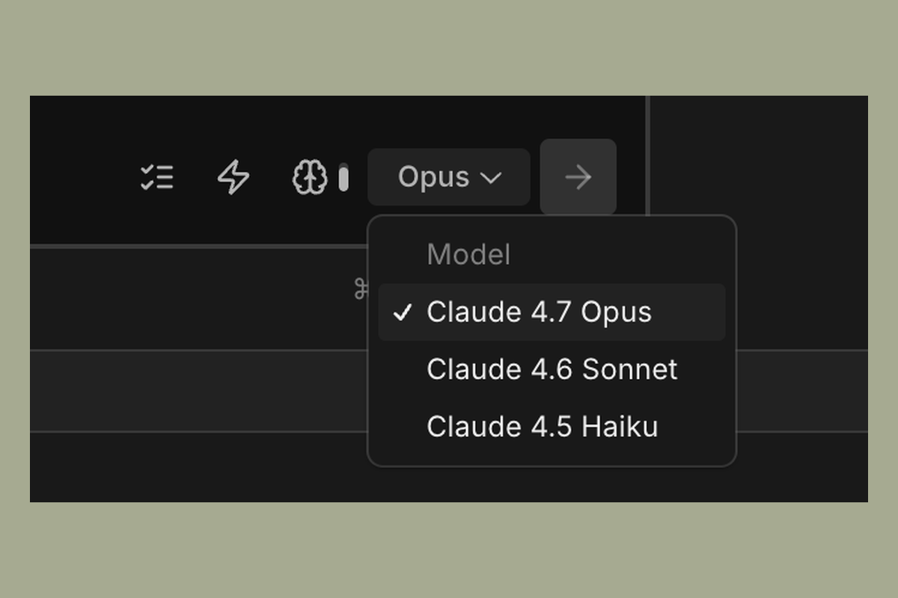
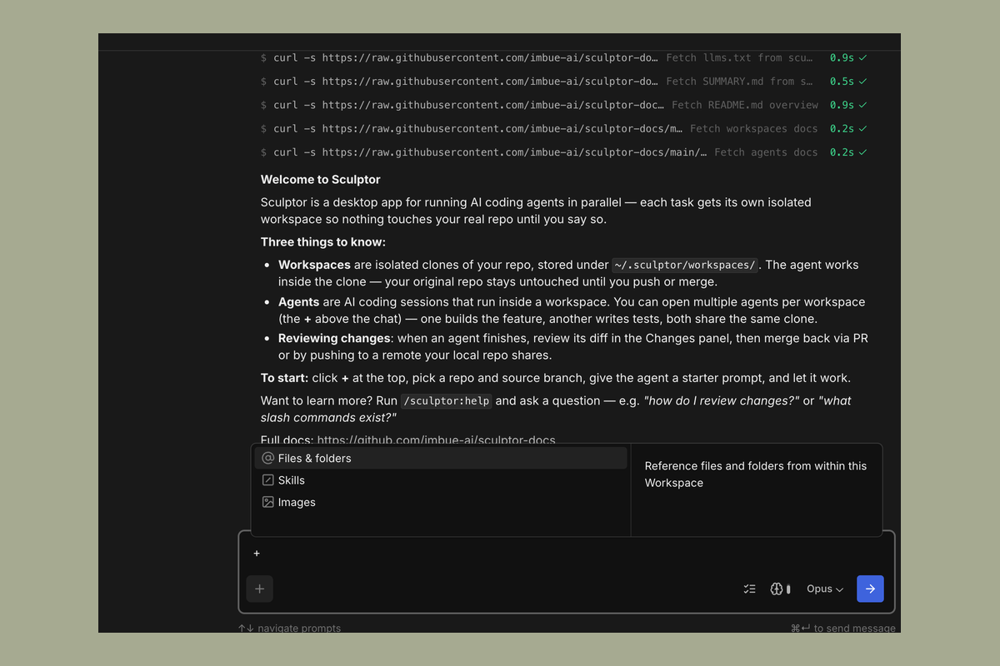
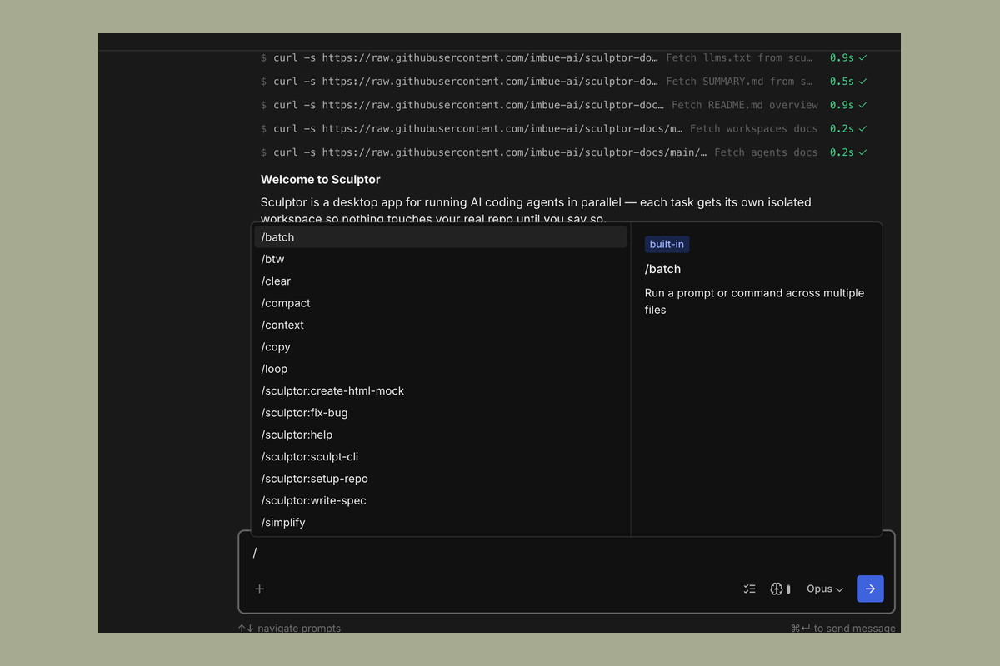

# Chat

The chat panel is the main place you direct an agent. Type your task in the
input box at the bottom and send it; the agent's responses, tool calls, and
progress appear in the panel above.

---

## Model picker

The model picker sits in the chat input toolbar, to the left of the send button.
Click it to switch the model for the current agent session. The change takes
effect on the next message you send. You can set the default model for new
agents under **Settings**.

---

## Mentions and attaching context

The **+** button on the left side of the chat input toolbar opens a menu for
adding context to your next message. The same menu opens when you type `@` in the
input. From it you can:

- **Files & folders** — point the agent at a specific file or directory in your
  repo. The agent loads it into context.
- **Skills** — start a slash command. (You can also type `/` directly.)
- **Images** — attach a screenshot, design reference, or other image. You can
  also drag and drop images onto the input, or paste them directly.

Attached files appear as small pills above the input; click the **×** on a pill
to remove it.

Images shown in the chat — whether you attached them or an agent produced them —
can be clicked to open at full size. To save one out, right-click the image
(either the thumbnail in a message or the full-size view) and choose
**Copy Image** to copy it to your clipboard.

---

## Tracking context usage

After each agent turn, the turn footer shows how much of the model's context
window the conversation has used — for example, **45% context**. Click the
percentage to see a token breakdown.

To free up context, use `/compact` (summarize the conversation so far) or
`/clear` (start a fresh conversation). See [Slash commands](#slash-commands)
below for details.

---

## Plan, fast, and effort

The right side of the chat input toolbar — between the message input and the send
button — has three controls that shape how the agent handles your next message.

**Plan mode** (checklist icon) — Toggle on to make the agent plan before it acts.
It reads the relevant parts of the codebase, writes up a plan, and waits for your
approval before making any changes. Useful for larger tasks where you want to
review the approach first. Toggle off to return to the default "act first"
behavior.

**Fast mode** (lightning-bolt icon) — Toggle on for faster output. Trades some
depth for speed; useful for quick iteration. You can set the default for new
agents under **Settings**.

**Effort level** (brain icon with a fill bar) — Click to pick how much thinking
the agent budgets for each step: **Low**, **Medium**, **High**, **Extra High**
(the default), and **Max**. Lower effort is faster and cheaper; higher effort is
slower but more thorough.

---

## Slash commands

Type `/` in the input box to open the command and skill picker. It lists
Sculptor's built-in commands, the bundled skills, and any skills or commands
you've installed locally — all sorted alphabetically.

**Conversation commands** act on the current agent session:

- `/clear` — clear the conversation context to start a fresh task.
- `/compact` — summarize the conversation so far to free up context.
- `/context` — visualize what's using context, to decide whether to compact or clear.
- `/copy` — copy the last response to your clipboard.

**Skills** run as full agents with their own tools. A few general-purpose ones —
`/batch`, `/btw`, `/loop`, `/simplify` — handle work you'd otherwise re-prompt
for, and two skill bundles (`sculptor-workflow` and `sculptor-experimental`)
make up Sculptor's engineering workflow. See [Skills](skills.md) for the full
reference, and the
[Claude Code commands reference](https://code.claude.com/docs/en/commands) for
everything else.

---

## Agent tasks

For complex work, the agent breaks the task into discrete steps — a todo list it
plans and works through. While the agent is running, its progress shows in the
status indicator above the chat input (for example, **1 / 8** with the current
step). Hover over or click the indicator to expand the full list, where each
step is marked pending, in progress, or done.

If the agent goes off track, send a correction in the chat input to redirect it;
the task list updates to reflect the new plan.
