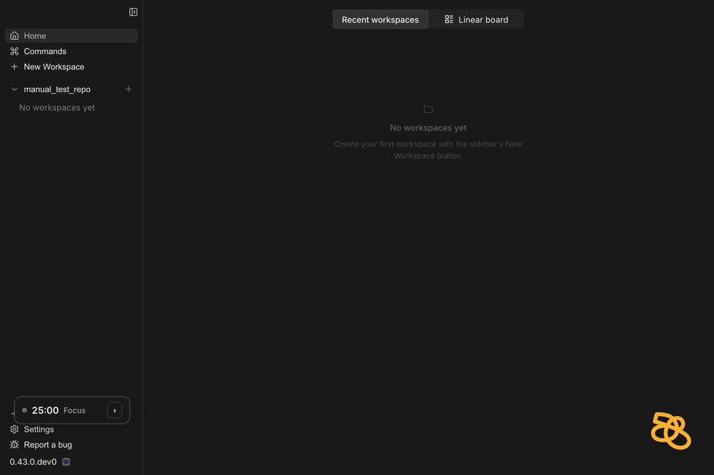
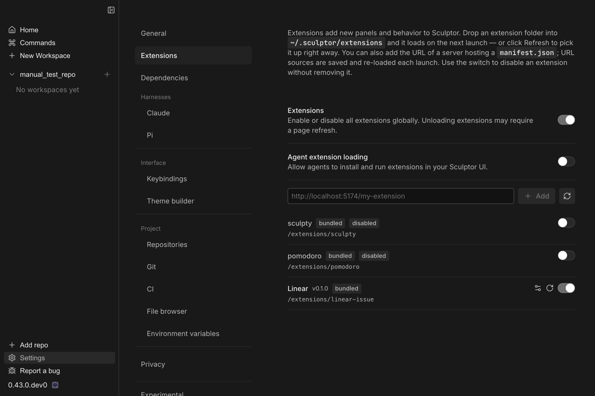

# Extensions

Sculptor supports **extensions** — small JavaScript modules loaded into the app
at runtime that add new UI: panels, workspace widgets, alternative home pages,
and overlays. Extensions don't require rebuilding or reinstalling Sculptor: you
drop them in as files (or load them live from a workspace) and they run
immediately. You can enable the bundled ones, install extensions others have
written, or have an agent build a custom one for you in minutes.

> **Upgrading?** In earlier releases extensions were called *plugins*. Anything
> in the old `~/.sculptor/plugins` directory is migrated automatically, and the
> old `sculpt plugin` command still works as an alias for `sculpt extension`.

---

## What an extension can add

- **Panels** — a new panel in a workspace's left, right, or bottom zone,
  alongside the built-in Chat, Changes, and Terminal panels.
- **Workspace widgets** — compact controls in the workspace header's action
  row, next to the pull-request button.
- **Home views** — an alternative homepage body. When at least one extension
  registers a home view, a switcher appears on the homepage so you can flip
  between it and the default view.
- **Overlays** — a floating layer above the whole app that stays visible
  across every screen.
- **Settings** — each extension can contribute its own configuration UI, shown
  under its entry in **Settings → Extensions**.

Extensions run inside the Sculptor frontend and can read live app state — the
current workspace, its branch and pull request, the full workspace list — and
persist their own settings. Each one is isolated behind an error boundary: if
an extension crashes while rendering, its slot shows an error message and the
rest of the app keeps working.



---

## Bundled extensions

Three extensions ship with Sculptor. Toggle them in **Settings → Extensions**:

- **Linear** *(on by default)* — connects Sculptor to Linear. Adds a workspace
  panel showing the issues linked to the current branch and pull request, a
  compact issue widget in the workspace header, and a board-style home view of
  your assigned issues grouped by status. Set your Linear API key in the
  extension's settings entry to activate it.
- **Sculpty** *(off by default)* — a desktop buddy in the corner of the app.
  The Sculptor squiggle dozes when you're away, bobs along while you work, and
  perks up when you're typing up a storm.
- **Pomodoro** *(off by default)* — a small floating pomodoro timer with a
  task label, visible across the whole app.

---

## Managing extensions

Everything lives in **Settings → Extensions**:



- **Per-extension toggles** — enable or disable each extension individually.
  Changes apply live.
- **Status** — each row shows whether the extension loaded, and if it failed,
  at which phase and with what error. A reload button on a failed row retries.
- **Refresh** — re-scans the extensions directory for newly dropped-in
  extensions without restarting the app.
- **Add** — the field above the list registers an extension served from a URL
  (see [Installing an extension](#installing-an-extension) below).

Two global switches sit at the top of the section:

- **Extensions** *(on by default)* — the master switch for the whole extension
  system. Turning it off disables loading extensions entirely (a full app
  reload is needed for it to take effect).
- **Agent extension loading** *(off by default)* — allows agents to install
  and reload extensions in your UI via the `sculpt extension` CLI. Because
  this effectively lets a workspace run arbitrary code in your Sculptor UI,
  it's off until you opt in. Read-only commands (`list`, `inspect`, `dir`)
  work regardless.

---

## Installing an extension

An extension is a folder containing a `manifest.json` and a JavaScript entry
module. There are two ways to install one:

**From a folder** — copy it into the extensions directory:
`~/.sculptor/extensions/<extension-id>/` (the exact path is shown in
**Settings → Extensions**, or run `sculpt extension dir`). Then click
**Refresh** in **Settings → Extensions** (or restart the app).

**From a URL** — paste the URL the extension is served from (for example
`http://localhost:5174/my-extension`) into the field at the top of
**Settings → Extensions** and click **Add**. Sculptor fetches the extension's
`manifest.json` — and everything else it needs — from that address. URL
sources are saved to your list and re-fetched on launch, so they suit both
extensions hosted somewhere and local development against a dev server, where
the running extension picks up your edits without a reinstall.

Either kind can also be added from inside a workspace:
`sculpt extension load <dir> --persist` packages a folder and installs it
permanently in one step, and `sculpt extension load <url>` registers a URL
source (this requires the **Agent extension loading** toggle when run by an
agent).

---

## Building your own

The fastest route is to ask an agent. The bundled
`/sculptor:build-sculptor-extension` skill is a self-contained reference — it
works from **any** repo, no Sculptor source checkout needed — that teaches the
agent the manifest format, the SDK, and the live-development loop. Enable
**Agent extension loading** in **Settings → Extensions**, then try:

> Use /sculptor:build-sculptor-extension to build me a panel that shows …

The agent writes the extension, loads it into your running UI with
`sculpt extension load`, and iterates with `sculpt extension reload` while you
watch the result live.

If you'd rather write one by hand, the minimal extension is two files:

```json
// manifest.json
{ "id": "hello", "name": "Hello", "version": "0.1.0", "entry": "main.js", "sdkVersion": "^1.0.0" }
```

```js
// main.js — an ES module; default-export an activate function
export default function activate(api) {
  const el = document.createElement("div");
  el.textContent = "hello from an extension";
  el.style.cssText = "position:fixed;bottom:16px;right:16px;pointer-events:auto;";
  document.body.appendChild(el);
  return () => el.remove(); // cleanup on unload/reload
}
```

Drop the folder into the extensions directory (or `sculpt extension load` it)
and it's running. No build step is required — plain JavaScript works, and
React is available through the host if you want it. For the full SDK contract
(panels, widgets, home views, workspace data hooks, persisted settings), see
the
[skill reference](../../sculptor/sculptor-plugin/skills/build-sculptor-extension/SKILL.md)
that ships with Sculptor.

### The development loop (`sculpt extension`)

The `sculpt` CLI manages extensions in the live UI from any workspace terminal
or agent session:

| Command | What it does |
| --- | --- |
| `sculpt extension load <dir\|url> [--persist]` | Load an extension into the live UI. Without `--persist` it's a dev install scoped to the current workspace; with it, a permanent install. |
| `sculpt extension reload <id>` | Re-fetch and re-import after an edit. |
| `sculpt extension list` | All extensions with their live status. |
| `sculpt extension inspect <id>` | One extension's status, registrations, and setting key names (values are never shown). |
| `sculpt extension unload <id>` | Unload from the UI; files stay on disk. |
| `sculpt extension remove <id>` | Unload and delete the workspace's dev install. |
| `sculpt extension dir` | Print the extensions directory path. |

`load` and `reload` wait for the extension to finish loading and report
success or the failing phase and error, so you (or the agent) know immediately
whether an edit worked.

---

## Troubleshooting

- **An extension doesn't appear** — check **Settings → Extensions**: is the
  master **Extensions** toggle on, and is the extension's own toggle on? If
  you dropped it in by hand, click **Refresh**.
- **A row shows "failed"** — the row includes the failing phase and error
  message. Fix the extension and use the row's reload button (or
  `sculpt extension reload <id>`).
- **An extension's panel shows an error box** — the extension crashed while
  rendering. The rest of the app is unaffected; reload the extension after
  fixing it.
- **`sculpt extension load` fails with a permissions error** — enable
  **Agent extension loading** in **Settings → Extensions**.
