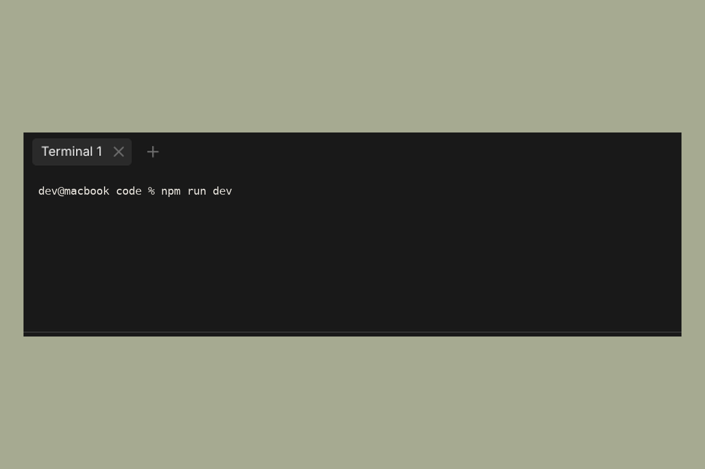

# Terminal

Sculptor has a built-in terminal that runs in the context of the current
workspace, so any commands you run operate on the same files the agent is
working with.

Open the terminal from the command palette (`Cmd+K`, then search **Terminal**) or
the panel controls in the bottom bar.

---

## What it's for

The terminal is useful for:

- Starting a dev server to test the agent's changes
- Running tests or linters directly
- Inspecting git state (`git log`, `git diff`, etc.)
- Any CLI operation that's easier to run yourself than to ask the agent to do

You can have the terminal open alongside an active agent session — they don't
interfere with each other.

---

## Multiple terminals

You can open more than one terminal. Click the **+** in the terminal tab bar to
add a tab, and double-click a tab to rename it. Each tab is an independent shell
in the same workspace. Press `Ctrl+L` to clear the active terminal.
