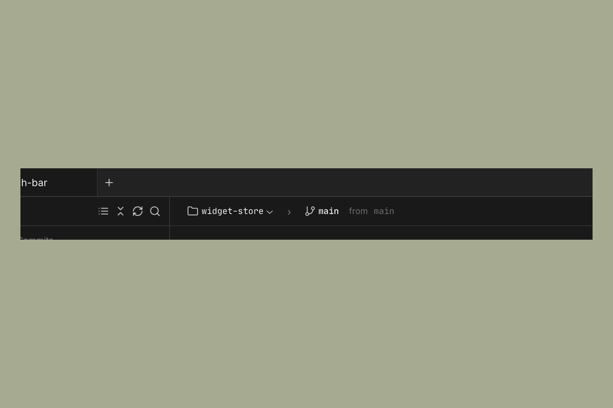

# Workspaces

A workspace is an isolated working copy of one repository, on its own branch.
Each workspace runs its agents against that copy, so your current branch and
uncommitted work are never touched.

By default a workspace is a **git worktree** off your repo: the agent works on a
new branch in a separate directory that shares your repo's git history. Because
it's a worktree, that branch lives in your repo — you can check it out or push it
directly, with no separate remote to sync.

---

## The top bar

The top bar shows `repo › branch → target-branch`, plus a summary of changes and
the pull-request button.

Click the repo name for **Open folder**, **Copy path**, and entries for opening
the directory in your editor or terminal. Click the branch name to copy it.

---

## Creating a workspace

Click the **+** button at the top of the Sculptor window. Choose a repository,
pick a source branch, and optionally set the workspace branch name, a name, and a
starter prompt. Each workspace gets its own tab; switching tabs switches repos and
agent sessions.

---

## Workspace modes

The default mode is **worktree** (above). Two other modes are available under
**Settings > Experimental**:

- **Clone** — a full, separate clone of the repo with its own `local` remote that
  you sync back explicitly.
- **In-place** — the agent works directly in your original repository, with no
  separate copy.

---

## Branches

- **Branch name** — new workspace branches follow a pattern, `<user>/<slug>` by
  default. Set a different default or per-repo pattern in **Settings > Git** and
  **Settings > Repositories**.
- **Target branch** — the branch your work merges back into. Set a default in
  **Settings > Git**, and override it per workspace from the top bar.
- **Branch cleanup** — when you delete a worktree workspace, Sculptor can delete
  its branch (never, only when safe, or always) per your **Settings > Git** policy.

---

## Per-repo setup and environment

Configure these in **Settings > Repositories** and **Settings > Environment
variables**:

- **Setup command** — a shell command (e.g. `npm install`) run when a workspace
  is created.
- **Environment variables** — loaded from `~/.sculptor/.env` (all repos) and a
  per-repo `.sculptor/.env` (add it to `.gitignore`).

---

## Where the data lives

Workspaces live under `~/.sculptor/workspaces/`, each in its own directory keyed
by an internal ID, with the working copy at `code/`. Open a terminal
(see [Terminal](terminal.md)) to inspect one directly.
