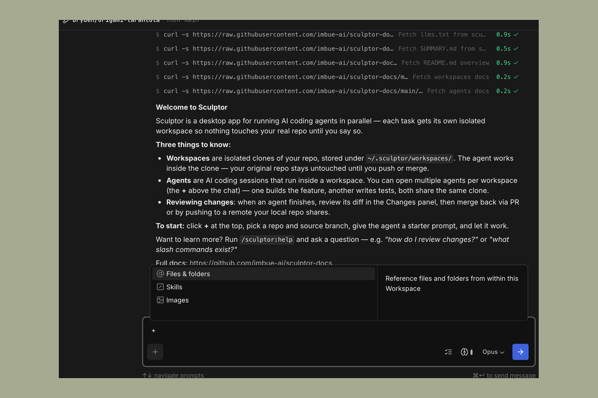
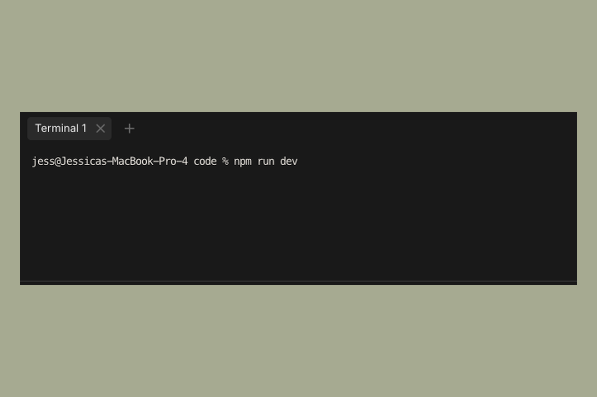

# Interface

This page covers the main UI elements in Sculptor and how to use them.

---

## Chat panel

The main panel is where you direct the agent. Type your task in the input box at the bottom and send it. The agent's responses, tool calls, and progress appear in the panel above.

---

## Agent tasks panel

For complex tasks, the agent breaks the work down into discrete steps. These steps are visible in the **Agent tasks** panel.

Each entry in the panel represents one unit of work the agent has planned or is actively executing. You can use this to track progress on longer tasks without needing to follow every message in the chat panel.

If the agent goes off track, you can send a correction message in the chat panel to redirect it. The task list will update to reflect the new plan.

The panel is closed by default. Click the Agent tasks icon in the right sidebar to open it.

---

## Model picker

The model picker sits in the chat input toolbar, to the left of the send button. Click it to switch the model for the current agent session. The change takes effect on the next message you send.

---

## Attaching context

The **+** button on the left side of the chat input toolbar opens a menu for adding context to your next message. The same menu opens when you type `@` in the input. From it you can:

- **Files & folders** — point the agent at a specific file or directory in your repo. The agent will load it into context.
- **Skills** — start a slash command. (You can also type `/` directly to do this.)
- **Images** — attach a screenshot, design reference, or other image. You can also drag and drop images onto the input, or paste them directly.

---

## Tracking context usage

After each agent turn, the turn footer shows how much of the model's context window the conversation has used — for example, **45% context**. Click the percentage to see a token breakdown.

To free up context, use `/compact` (summarize the conversation so far) or `/clear` (start a fresh conversation). See [Slash Commands](slash-commands.md) for details.

---

## Plan mode, fast mode, and effort level

The right side of the chat input toolbar — between the message input and the send button — has three controls that shape how the agent handles your next message.

**Plan mode** (checklist icon) — Toggle on to make the agent plan before it acts. It reads the relevant parts of the codebase, writes up a plan, and waits for your approval before making any changes. Useful for larger tasks where you want to review the approach before the agent starts touching files. Toggle off to return to the default "act first" behavior.

**Fast mode** (lightning-bolt icon) — Toggle on for faster output. Trades some depth for speed; useful for quick iteration where you don't need the agent to think deeply. You can set the default for new agents under **Settings** if you'd rather have it on everywhere.

**Effort level** (brain icon with a fill bar) — Click to pick how much thinking the agent should budget for each step. Options are **Low**, **Medium**, **High**, **Extra High** (the default), and **Max**. Lower effort is faster and cheaper; higher effort is slower but more thorough.

---

## Slash commands

Type `/` in the input box to open a list of available commands and skills. These include conversation commands like `/clear` and `/compact`, workflow skills like `/batch` and `/simplify`, and the `sculptor:*` skills bundled with the app. See [Slash Commands](slash-commands.md) for the full reference.

---

## Terminal

Click the Terminal icon in the left sidebar to open a terminal session. The terminal runs in the context of the current workspace clone, so any commands you run operate on the same files the agent is working with.

This is useful for:

- Starting a dev server to test the agent's changes
- Running tests or linters directly
- Inspecting git state (`git log`, `git diff`, etc.)
- Any CLI operation that's easier to run yourself than to ask the agent to do

You can have the terminal open alongside an active agent session. They don't interfere with each other.

