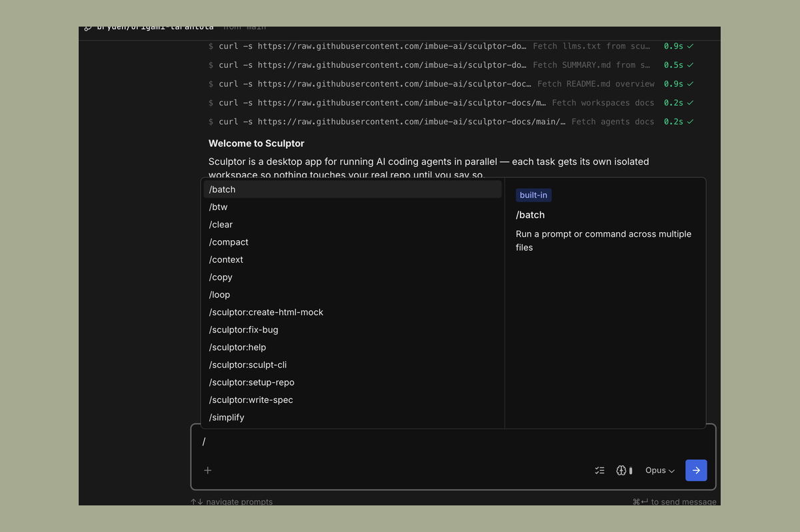

# Slash Commands

Type `/` in the Sculptor input box to open the command and skill picker. The picker lists Sculptor's own commands, skills you can run inside an agent session, and any skills or commands you've installed locally — all sorted alphabetically.

---

## Conversation commands

These act on the current agent conversation.

### `/clear`

Clear the current agent's conversation context. Use this when you're starting a new task and don't need the previous conversation carried forward.

### `/compact`

Summarize the conversation so far into a short context-summary block, freeing context without losing the thread. Useful in long sessions when you're approaching the context limit.

### `/context`

Visualize current context usage. Opens a breakdown of what's taking up tokens in the conversation so you can decide whether to `/compact` or `/clear`.

### `/copy`

Copy the last assistant response to your clipboard.

---

## Workflow skills

These run as full agents with their own tools, so they can read files, spawn parallel subagents, and adapt to your codebase.

### `/batch <instruction>`

Run a prompt or command across multiple files. The agent decomposes the work into independent units and executes them in parallel.

Example: `/batch migrate src/ from Solid to React`

### `/btw <question>`

Ask a quick, read-only side question without disturbing the agent's current task. The agent answers without making any changes.

Example: `/btw which file owns the auth middleware?`

### `/loop [interval] <prompt>`

Run a prompt or slash command on a recurring interval. Useful for polling a deployment, watching a PR, or periodically re-running another skill. Omit the interval to let the model self-pace.

Example: `/loop 5m check if the deploy finished`

### `/simplify [focus]`

Review changed code for reuse, quality, and efficiency issues, then fix them. Pass text to focus on a specific concern.

Example: `/simplify focus on memory efficiency`

---

## Bundled `sculptor:*` skills

These ship with Sculptor and are available in every workspace.

### `/sculptor:create-html-mock`

Generate HTML mocks for a feature through guided iteration. Two modes: exploration (several end-to-end variants you can compare side by side) and confirmation (refine a single coherent mock).

### `/sculptor:fix-bug`

Fix a bug using test-driven development. Input: a description of the bug to fix, or a bug ticket ID.

### `/sculptor:help`

Answer questions about Sculptor by fetching the live docs. Use this when you want a quick answer without leaving the chat.

### `/sculptor:sculpt-cli`

Interact with Sculptor programmatically using the `sculpt` CLI — create tasks, list tasks, or manage projects.

### `/sculptor:setup-repo`

Create or update the repo's Sculptor configs (`.sculptor/code.md`, `.sculptor/testing.md`, and `.sculptor/docs.md`). These files teach Sculptor how to build, run, test, and write specs for the current codebase.

### `/sculptor:write-spec`

Write an implementation spec through guided Q&A before writing any code.

---

## Your own skills and commands

Sculptor also surfaces any skills or commands you've installed under `~/.claude/skills/` or `~/.claude/commands/`, as well as any under the current repo's `.claude/` directory. These appear in the picker alongside the built-ins, sorted alphabetically.

For everything else, see the [Claude Code commands reference](https://code.claude.com/docs/en/commands).
