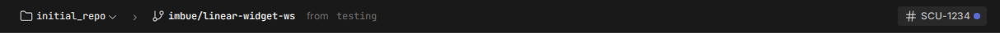

# Frontend extensions

This directory holds the source for runtime-loaded frontend extensions. Each
subdirectory is an independent Vite project that builds an ESM bundle into
the host's `public/extensions/<id>/` tree. The host loads built-in extensions
plus any user-added sources — see `src/extensions/extensionManager.tsx`.

The whole system sits behind a master switch at the top of the **Extensions**
settings section. That section is always visible (it hosts the switch, so it
must stay reachable to flip the system back on) and lists every known source:
bundled extensions, local drop-ins, and user-added URLs — each with an
enable/disable switch, a reload button, and the extension's own settings if it
registers any. The section is also reachable directly at
`#/settings?section=EXTENSIONS`.

Beyond the bundled set, extensions load from two other kinds of source:

- **Local drop-ins**: a folder (`manifest.json` + `main.js`) placed in the
  Sculptor data directory's `extensions/` folder (`~/.sculptor/extensions` on a
  release build). The backend serves these at `/extensions/local/<id>`; the
  Refresh button in the Extensions settings re-scans the folder without a
  reload. Agents install and iterate on extensions this way via the
  `sculpt extension` CLI (`load`, `reload`, `inspect`, `unload`, …), and the
  **build-sculptor-plugin** skill teaches any agent how to author one.
- **URL sources**: the URL of a server hosting a `manifest.json` (e.g. a Vite
  dev server), added from the Extensions settings. URL sources are persisted
  to localStorage and re-loaded each launch.

The bundled example is `linear-issue`. It shows the Linear issues linked to a
workspace as collapsible sections, each tagged with where it came from: the
branch's issue (primary — `issueVcsBranchSearch`, then an identifier parsed from
the branch name, then the workspace's PR resolved via `attachmentsForURL`, so
Sculptor-generated branches that Linear has no link for still resolve), the
issues that issue's PR links to (`attachmentsForURL`), and any the user pins via
a quick-search box (`searchIssues`). It renders descriptions with the
SDK `Markdown` component, opens links via `openExternal`, and stores its API
key and per-workspace pins through the extension-settings SDK. It also
contributes a **workspace widget** (`registerWorkspaceWidget`) — a compact
ticket chip the host renders in the workspace banner beside the PR button. The
widget defaults to the branch ticket but follows whatever ticket the user
assigns from the panel; the two share a single per-workspace ticket-assignment
setting, so the ticket reference stays consistent across both surfaces.

It also registers a **home view** (`registerHomeView`) — a "Linear board" the
homepage offers in its view switcher — listing the current user's assigned
issues grouped by workflow state, with each ticket flagged by whether a Sculptor
workspace already exists for it (and a button into that workspace, via
`useNavigateToWorkspace`). The workspace↔ticket matching lives in one place
(`linear/association.ts`) shared with the panel, so the two surfaces agree on
which workspace is working which ticket.

It is structured as a
reference: a `linear/` core (Linear client, source-merging, query hooks) kept
separate from presentational `components/`, with `index.tsx` doing only
`activate()` wiring.

`openhost-preview-switcher` is a second compiled extension, but deliberately NOT
built-in: it only makes sense behind the OpenHost nginx `/proxy` front (see
`openhost-nginx.conf` at the repo root), where it is installed as a *local*
extension by dropping its built output into the backend's
`<sculptor-folder>/extensions/openhost-preview-switcher/`. It contributes an
overlay (`registerOverlay`) — a pill in the footer strip's empty bottom-left
corner — that lists the live Vite dev previews behind `/proxy/<port>/` and
switches between them and the deployed app, preserving the `#/` route. On a
preview it becomes an amber badge showing that preview's identity (the
`sculptor-preview` meta injected by `vite.base.config.ts`).

## How an extension is built and loaded

An extension is loaded from `public/extensions/<id>/` (a `manifest.json` next
to a `main.js` ESM bundle). There are two ways that tree gets populated:

- **Pure-JS extensions** commit their `main.js` + `manifest.json` directly under
  `public/extensions/<id>/` — no build step. `sculpty` and `pomodoro` are the
  examples.
- **Compiled extensions** keep TS/TSX source under `extensions/<id>/src/` and
  are built into `public/extensions/<id>/` by the host Vite build (see
  `vite-plugins/bundled-extensions.ts`), so `npm run build` and the dev server
  emit the bundle — there's no separate per-extension build to run, and no
  second toolchain (the extension reuses the host's Vite/React/TypeScript).
  `linear-issue` and `openhost-preview-switcher` are the compiled extensions
  today; their `public/extensions/<id>/` output is gitignored.

The build marks every shared dependency (`react`, `@radix-ui/themes`, `jotai`,
`@tanstack/react-query`, `lucide-react`, `@sculptor/extension-sdk`, …) external
— the exact set the import map provides, derived from
`RUNTIME_MODULE_SPECIFIERS` — so the bundle contains only the extension's own
code. Then, at load time:

1. The host fetches the source's `manifest.json`, validates the declared SDK
   major against its own, then dynamic-imports `main.js`.
2. The extension bundle's bare-specifier imports (`react`, etc.) resolve via
   the import map declared in `index.html` to runtime stubs that re-export from
   `window.__SCULPTOR_HOST__` — the host's actual singleton instances.
3. The extension's default export is an `activate(api)` function that calls
   `api.registerPanel({ ... })` and optionally `api.registerSettings(...)`.
   The host wraps contributed components in an `ExtensionErrorBoundary`, an
   `ExtensionContext` (extension id, for `useExtensionSetting`), and — for
   panels — a `WorkspaceExtensionContext` provider.

## SDK surface extensions target (`@sculptor/extension-sdk`)

The full contract is rolled up into
`sculptor/sculptor-plugin/skills/build-sculptor-plugin/sdk.d.ts` (generated —
`just generate-extension-sdk-dts`, freshness-checked in CI), which ships to
every Sculptor agent inside the build-sculptor-plugin skill. Highlights:

- `useCurrentWorkspace(selector?)` — the active workspace as a curated view
  (`id`, `description`, `branch`, `targetBranch`, `pullRequestUrl`); pass a
  selector to subscribe to one field, e.g.
  `useCurrentWorkspace((w) => w?.branch ?? null)`.
- `useWorkspaces()` — every workspace as the same curated `WorkspaceView` shape
  `useCurrentWorkspace` returns (`id`, `description`, `branch`, `targetBranch`,
  `pullRequestUrl`), or `undefined` until the first batch loads. App-global, so
  it works in overlays and home views.
- `useNavigateToWorkspace()` — returns `(workspaceId) => void` that opens a
  workspace exactly as clicking it in the host's own lists does (opens or
  converts its tab, then jumps to its most-recently-used agent). The blessed way
  for a home view to send the user into a workspace.
- `useWorkspaceTasks()` — the workspace's tasks (host task data).
- `useExtensionSetting(key)` — a persisted string setting scoped to the
  extension (stored per extension id in the renderer's localStorage), shared
  between the extension's panel and its settings component.
- `useExtensionSettings(keys)` — the multi-key companion: read many of the
  extension's settings at once, reactively, returning a `Map<key, value>`. For
  when the key set is dynamic (e.g. one key per workspace from
  `useWorkspaces`), where you can't call `useExtensionSetting` once per key.
- `Markdown` — the host's markdown renderer (`{ content: string }`); GFM,
  links open in a new tab, code blocks get copy buttons.
- `openExternal(url)` — open a URL in the user's browser (a new tab on the web;
  the system browser in the desktop app). Use this rather than `window.open`.
- `PanelHeader`, domain types, and the `ExtensionHostApi` / `PanelDefinition` /
  `WorkspaceWidgetDefinition` / `HomeViewDefinition` registration types (so
  extensions type `activate(api)` against the host contract instead of
  re-declaring it).

### Contribution points (`activate(api)`)

- `registerPanel(def)` — a panel in one of the workspace zones.
- `registerSettings(component)` — a settings section under the extension.
- `registerOverlay(def)` — an always-on, app-global floating layer.
- `registerWorkspaceWidget(def)` — a compact, workspace-scoped widget the host
  places in its workspace chrome (today the banner's action row, beside the PR
  button). Like a panel it is mounted in the `WorkspaceExtensionContext`, so the
  workspace SDK hooks resolve to the workspace it is shown for. `collapsePriority`
  (lower = hidden first) slots it into the banner's progressive-collapse order;
  the host's own banner items occupy a few small integers. The name is
  placement-agnostic on purpose — the same registration is what a future
  per-workspace vertical-tabs layout would render.
- `registerHomeView(def)` — a full-page alternative homepage body. The homepage
  shows a view switcher whenever at least one is registered; picking one replaces
  the built-in recent-workspaces list with the extension's component. The choice
  is remembered (per browser) and falls back to the built-in view if the
  extension is unloaded. Like an overlay it is app-global (no
  `WorkspaceExtensionContext`), so it reads app state through the SDK hooks.

## Caching fetched data (`@tanstack/react-query`)

Extensions may use `@tanstack/react-query` directly — it resolves through the
import map to the host's library and the host's **shared QueryClient**
(extension components render under the host's provider). Cached data survives
panel close/reopen and workspace switches, and concurrent mounts dedupe to one
request. Rules:

- **Key namespace**: the first element of every query key MUST be your
  extension id (e.g. `["my-extension", "issue", id]`). The host's keys live
  under the reserved `"sculptor"` prefix. A dev-mode guard warns on keys
  outside either namespace.
- **Set `staleTime` explicitly**: the host's default is `Infinity` (its
  queries are invalidated by the WebSocket stream); without an override your
  data will never refetch.
- **Scope imperative calls to your namespace**:
  `invalidateQueries({ queryKey: ["<your-id>"] })` is fine; never call
  `clear()` or unfiltered `invalidateQueries()` — the cache is shared with the
  host.
- `QueryClient`/`QueryClientProvider` are intentionally not exported by the
  runtime stub: don't construct your own client, it would cut host components
  rendered inside your subtree off from the shared cache.
- Don't put secrets (API keys) in query keys — keys are visible in cache
  inspection/devtools. Close over them in the `queryFn` and invalidate your
  namespace when they change.

## Adding an extension

1. Author the extension. For a pure-JS extension, commit `main.js` +
   `manifest.json` (`id`, `name`, `version`, `entry`, `sdkVersion`) under
   `public/extensions/<id>/`. For a compiled (TS/TSX) extension, put source
   under `extensions/<id>/src/` with a `manifest.json` and a `tsconfig.json`,
   then add its id to `COMPILED_EXTENSION_IDS` in
   `vite-plugins/bundled-extensions.ts` so the host build emits its bundle.
2. Add `/extensions/<id>` to `BUILTIN_SOURCES` in
   `src/extensions/extensionManager.tsx` to ship it built-in, or add it as a
   source at runtime via the Extensions settings.
3. The host build (or dev server) produces the bundle; the host picks it up on
   next reload.

## What's mocked vs. real

- The built-in extension list is hardcoded; user sources are persisted to
  localStorage and managed from the Extensions settings.
- The SDK package is published as a runtime stub via the import map; it
  is not yet a separate npm package.
- `useExtensionSetting` persists to localStorage in the renderer; it is not a
  secure secret store.
